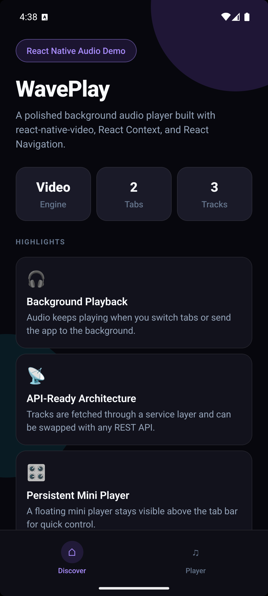
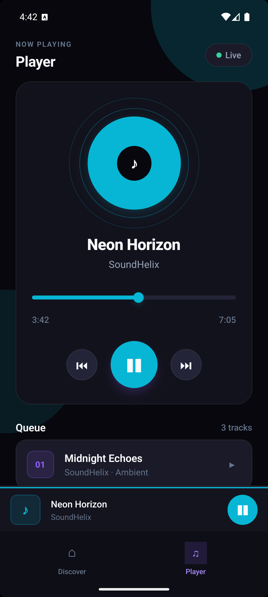
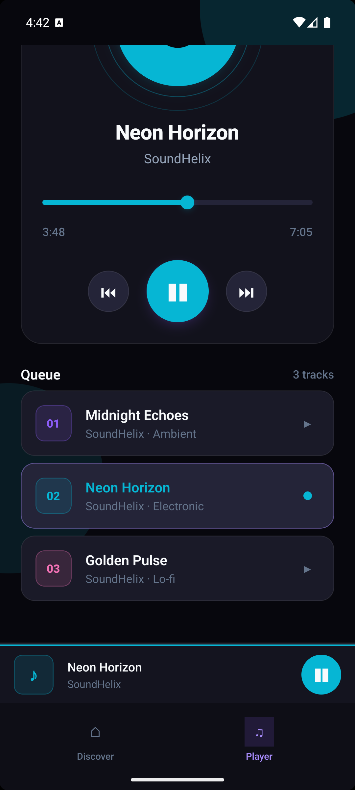
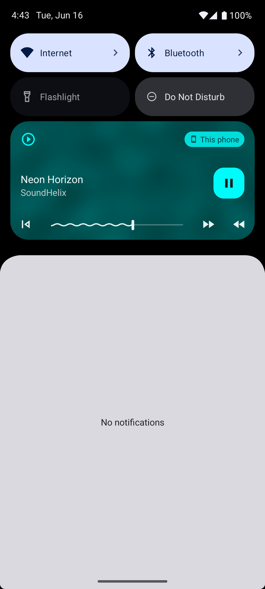
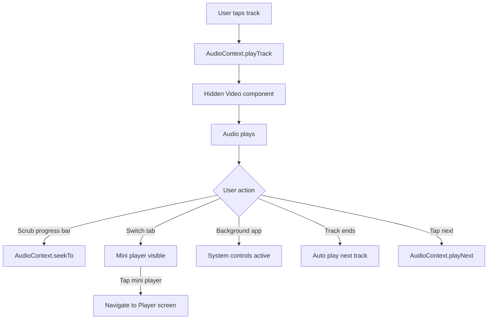

# WavePlay

> A React Native background audio player built with **react-native-video**, global state, and tab navigation — designed to showcase mobile audio architecture on GitHub.

[](https://reactnative.dev)
[](https://www.typescriptlang.org/)
[](https://github.com/anshulthakur/waveplay)
[](#license)

WavePlay demonstrates how to build a production-style audio experience in React Native without a dedicated track-player library. It uses a hidden `Video` component as an audio engine, keeps playback alive across screens, and exposes lock-screen / notification controls on both platforms.

---

## Preview

| Discover | Player | Mini Player |
|----------|--------|-------------|
|  |  |  |

| System Controls |
|-----------------|
|  |

---

## Features

- **Background playback** — audio continues when the app is backgrounded
- **Cross-screen persistence** — playback survives tab navigation
- **Mini player bar** — pinned above the tab bar with play/pause and tap-to-expand
- **Full scrollable player** — header, artwork, controls, and queue scroll together
- **Seekable progress bar** — drag or tap to scrub to any position in the track
- **Playback controls** — previous, play/pause (`▶` / `❚❚`), and next buttons
- **Auto-play next** — automatically plays the next track when the current one ends
- **System media controls** — lock screen and notification controls via `showNotificationControls`
- **API-ready layer** — track list fetched through a service module (easy to swap for REST)
- **Polished dark UI** — cohesive theme, ambient glow backgrounds, and per-track accent colors

---

## Tech Stack

| Layer | Technology |
|-------|------------|
| Framework | React Native 0.86 |
| Language | TypeScript |
| Audio Engine | [react-native-video](https://github.com/TheWidlarzGroup/react-native-video) |
| Navigation | React Navigation (Bottom Tabs) |
| State | React Context |
| Safe Areas | react-native-safe-area-context |

---

## Architecture

```text
App
├── AudioProvider          # Global playback state + hidden Video instance
│   └── RootNavigator      # Bottom tab navigation
│       ├── HomeScreen     # Discover / project overview
│       ├── PlayerScreen   # Scrollable full player + track queue
│       └── CustomTabBar
│           └── MiniPlayerBar
```



### How audio works

Instead of rendering a visible video player, WavePlay mounts a single hidden `<Video />` at the root inside `AudioProvider`. React Native Video handles streaming, background audio sessions, and native media notifications.

Key props used:

```tsx
playInBackground
playWhenInactive
ignoreSilentSwitch="ignore"
showNotificationControls
paused={!isPlaying}
```

### `useAudio()` API

| Method / State | Description |
|----------------|-------------|
| `tracks` | Loaded track list |
| `currentTrack` | Currently selected track |
| `isPlaying` | Playback state |
| `progress` / `duration` | Current time and total duration (seconds) |
| `playTrack(track)` | Start playing a track |
| `playNext()` | Skip to the next track |
| `playPrevious()` | Go to the previous track |
| `togglePlayPause()` | Toggle play / pause |
| `seekTo(time)` | Seek to a position in seconds |
| `loadTracks()` | Fetch tracks from the API layer |

---

## Project Structure

```text
src/
├── audio/
│   ├── AudioContext.tsx    # Playback state + hidden Video
│   ├── audioApi.ts         # Track fetching (mock API)
│   └── types.ts
├── components/
│   ├── AlbumArtwork.tsx
│   ├── MiniPlayerBar.tsx
│   ├── PlaybackControls.tsx
│   ├── ProgressBar.tsx     # Draggable seek bar
│   └── ScreenBackground.tsx
├── navigation/
│   ├── CustomTabBar.tsx
│   ├── RootNavigator.tsx
│   └── types.ts
├── screens/
│   ├── HomeScreen.tsx      # Discover tab
│   └── PlayerScreen.tsx    # Scrollable player + queue
├── theme/
│   ├── index.ts            # Colors, spacing, typography
│   └── icons.ts            # Shared play/pause icons
└── utils/
    └── formatTime.ts
```

---

## Getting Started

### Prerequisites

- Node.js >= 22.11.0
- React Native environment setup ([official guide](https://reactnative.dev/docs/set-up-your-environment))
- Xcode (iOS) / Android Studio (Android)

### Installation

```bash
git clone https://github.com/<your-username>/waveplay.git
cd waveplay
npm install
```

#### iOS

```bash
cd ios && pod install && cd ..
npm run ios
```

#### Android

```bash
npm run android
```

> After cloning, run a clean build if you previously had an older version installed:
> `cd android && ./gradlew clean && cd ..`

---

## Native Configuration

Background audio requires platform-specific setup already included in this repo.

### iOS — `ios/WavePlay/Info.plist`

```xml
<key>UIBackgroundModes</key>
<array>
  <string>audio</string>
</array>
```

Also enable **Background Modes → Audio, AirPlay, and Picture in Picture** in Xcode if testing notification controls on a real device.

### Android — `AndroidManifest.xml`

```xml
<uses-permission android:name="android.permission.FOREGROUND_SERVICE" />
<uses-permission android:name="android.permission.FOREGROUND_SERVICE_MEDIA_PLAYBACK" />

<service
  android:name="com.brentvatne.exoplayer.VideoPlaybackService"
  android:exported="false"
  android:foregroundServiceType="mediaPlayback">
  <intent-filter>
    <action android:name="androidx.media3.session.MediaSessionService" />
  </intent-filter>
</service>
```

---

## Connect Your API

Replace the mock data in `src/audio/audioApi.ts`:

```typescript
export async function fetchAudioTracks(): Promise<AudioTrack[]> {
  const response = await fetch('https://your-api.com/tracks');
  const data = await response.json();

  return data.map((item: any) => ({
    id: item.id,
    title: item.title,
    artist: item.artist,
    url: item.audioUrl,
    artwork: item.imageUrl,
    genre: item.genre,
  }));
}
```

The rest of the app reads tracks through `useAudio()` — no UI changes required.

---

## Scripts

| Command | Description |
|---------|-------------|
| `npm start` | Start Metro bundler |
| `npm run android` | Run on Android |
| `npm run ios` | Run on iOS |
| `npm run lint` | Run ESLint |
| `npm test` | Run Jest tests |

---

## Why react-native-video?

Many apps reach for dedicated audio libraries, but `react-native-video` is a solid choice when you already need media infrastructure or want a lighter integration. This project shows how to:

- Reuse one native player instance globally
- Enable background sessions with minimal config
- Surface OS-level media controls
- Seek and scrub via `videoRef.seek()`
- Keep UI and playback logic decoupled via Context

---

## License

MIT — free to use for learning, portfolios, and experimentation.

---

## Author

Built by **Anshul Thakur** as a React Native audio architecture showcase.

If this project helped you, consider giving it a star on GitHub.
